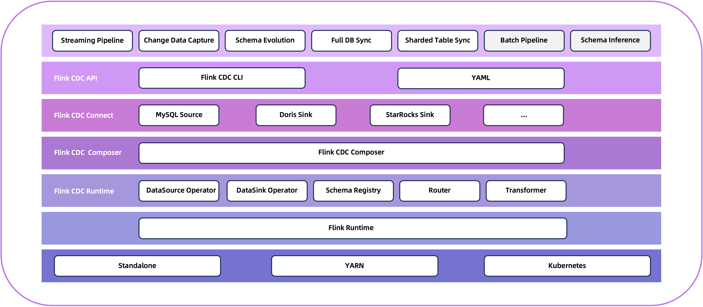

<p align="center">
    <strong><em>Flink CDC: A Streaming Data Integration Tool</em></strong>
</p>
<p align="center">
<a href="https://github.com/apache/flink-cdc/" target="_blank">
    
</a>
<a href="https://github.com/apache/flink-cdc/releases" target="_blank">
    
</a>
<a href="https://github.com/apache/flink-cdc/actions/workflows/flink_cdc.yml" target="_blank">
    
</a>
<a href="https://github.com/apache/flink-cdc/tree/master/LICENSE" target="_blank">
    
</a>
</p>

Flink CDC aims to provide users with a more **concise real time and batch data integration**. Users can configure their data synchronization logic using **yaml** api, and submit their jobs to Flink cluster easily. The framework prioritizes efficient end-to-end data integration and offers enhanced functionalities such as full database synchronization, sharding table synchronization, schema evolution and data transformation.    
The following graph shows the architecture layering of Flink CDC:



To learn more about concept of pipeline design, visit our [full documentation](docs/development/concept-pipeline).

### Getting Started

1. Create a Flink cluster [Apache Flink](https://nightlies.apache.org/flink/flink-docs-master/docs/try-flink/local_installation/#starting-and-stopping-a-local-cluster) and set up `FLINK_HOME` environment variable.
2. Download and unzip Flink CDC tar from [release page](https://github.com/apache/flink-cdc/releases), and put jars of pipeline connector to `lib` directory.
3. Create a **yaml** file to describe the expected data source and data sink.    
   The following file named `mysql-to-doris.yaml` provides a concise template:
  ```
      source:
       type: mysql
       name: MySQL Source
       hostname: 127.0.0.1
       port: 3306
       username: admin
       password: pass
       tables: adb.\.*
       server-id: 5401-5404
    
    sink:
      type: doris
      name: Doris Sink
      fenodes: 127.0.0.1:8030
      username: root
      password: pass
    
    pipeline:
       name: MySQL to Doris Pipeline
       parallelism: 4
  ```
4. Submit pipeline job using `flink-cdc.sh` script.
 ```
  bash bin/flink-cdc.sh /path/mysql-to-doris.yaml
 ```
5. View job execution status through Flink WebUI or target database.

Try it out yourself with our more detailed [tutorial](docs/try-flink-cdc/pipeline-connectors/mysql-doris-pipeline-tutorial/). See [connector overall](https://nightlies.apache.org/flink/flink-cdc-docs-release-3.0/docs/connectors/pipeline-connectors/overview/) to view a comprehensive catalog of the connectors currently provided and understand more detailed configuration parameters.
### Join the Community

There are many ways to participate in the Apache Flink CDC community. The [mailing lists](https://flink.apache.org/what-is-flink/community/#mailing-lists) are the primary place where all Flink committers are present. For user support and questions use the user mailing list. If you've found a problem of Flink CDC, please create a [Flink jira](https://issues.apache.org/jira/projects/FLINK/summary) and tag it with the `Flink CDC` tag.   
Bugs and feature requests can either be discussed on the dev mailing list or on Jira.

### Contributing

To contribute to Flink CDC, please see our [Developer Guide](docs/developer-guide/contribute-to-flink-cdc.md).

### License

[Apache 2.0 License](LICENSE).

### Special Thanks

The Flink CDC community welcomes everyone who is willing to contribute, whether it's through submitting bug reports, enhancing the documentation, or submitting code contributions for bug fixes, test additions, or new feature development.     
Thanks to all contributors for their enthusiastic contributions.

<a href="https://github.com/apache/flink-cdc/graphs/contributors">
  
</a>
